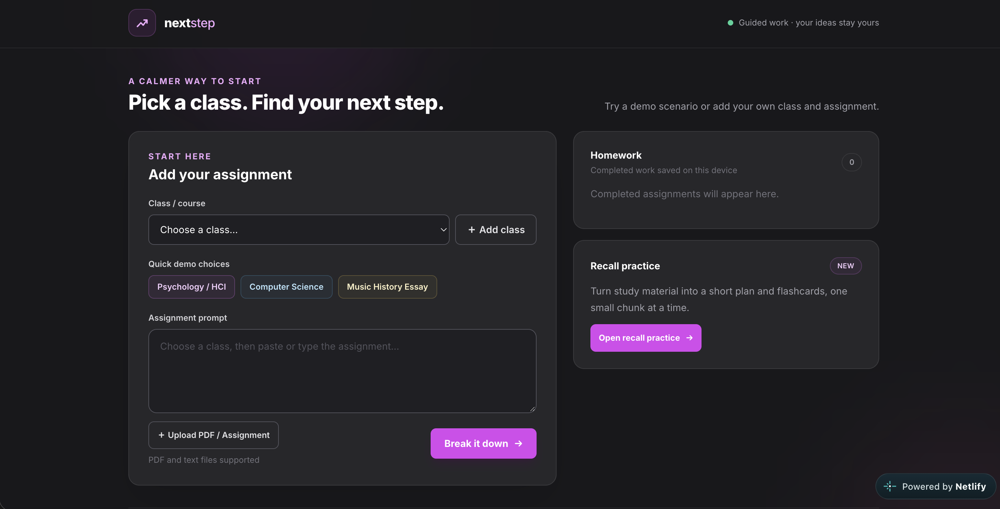
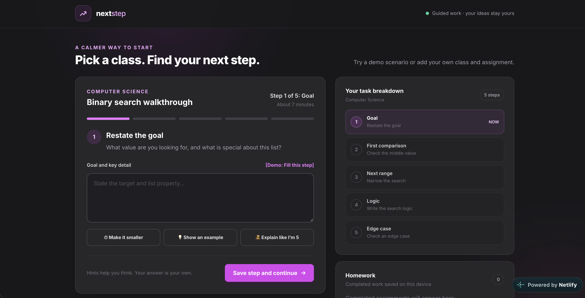
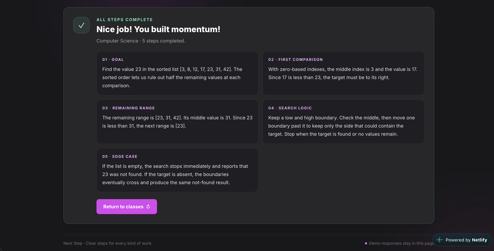
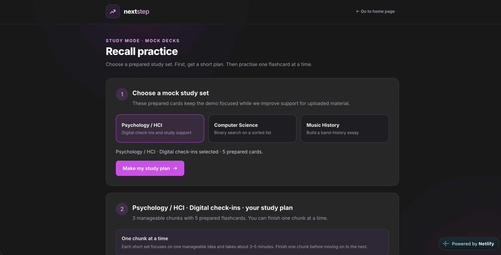
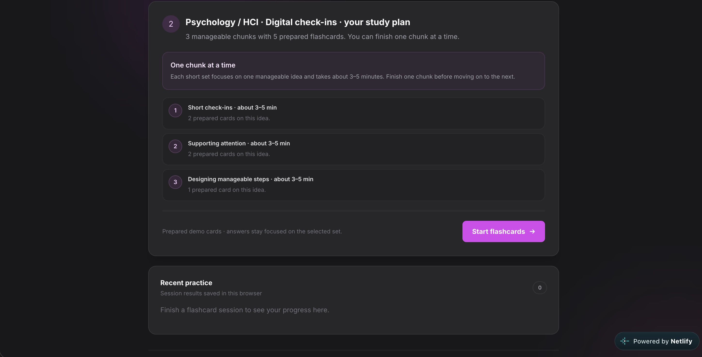

# Next Step

Next Step helps turn an overwhelming assignment into a few clear actions. This front-end prototype demonstrates three class scenarios, guided step-by-step support, a local homework library, and prepared active-recall flashcards.

## Try the live demo

Open the [Next Step live prototype](https://next-step-hackyeah2026.netlify.app) in a browser. The prototype is designed for a quick, click-through demo; you can use the prepared responses and do not need to enter your own work.

### Walk through an assignment

1. Under **Quick demo choices**, choose **Psychology / HCI**, **Computer Science**, or **Music History Essay**. These buttons select a class and load its sample assignment. Choosing a class from the dropdown alone does not fill the assignment.
2. Select **Break it down** to start that class’s workflow.
3. At each step, click **[Demo: Fill this step]** to add the prepared response. You can also try **Make it smaller**, **Show an example**, or **Explain like I’m 5** to see step-specific help.
4. Select **Save step and continue**. Repeat until the completion summary appears.
5. Return to classes, choose another quick demo, and try its different workflow.

| Demo class | What to try | Workflow length |
| --- | --- | ---: |
| Psychology / HCI | Propose a feature inspired by digital student check-ins | 3 steps |
| Computer Science | Trace binary search on a sorted list | 5 steps |
| Music History Essay | Plan a short band-history essay using evidence | 4 steps |

Completed work appears under **Homework** and is saved in the current browser. Try submitting the same scenario more than once to see multiple entries. Use **Return to classes** to reset the workspace and start another scenario.

### Try recall practice

1. From the home page, select **Open recall practice**.
2. Choose one of the prepared study sets: Psychology / HCI, Computer Science, or Music History.
3. Select **Make my study plan**, then **Start flashcards**.
4. Reveal each answer, optionally use **Explain in easy words** or **Give a real-life example**, then rate how well you remembered it.
5. Review the results chart and saved **Recent practice** history. You can make one additional attempt.

Recall practice currently uses prepared mock decks only. Assignment text and uploaded files are not used to generate flashcards.

## Screenshots

### Assignment workflow

### Recall practice

